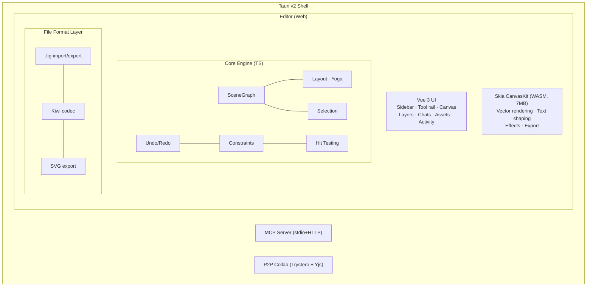

# Architecture

## System Overview

## Editor Layout

The editor uses a compact canvas-first layout:

- **Sidebar (left)** — Layers, Chats, Assets, and Activity in one floating surface
- **Tool rail** — Integrated drawing, selection, workspace, and utility controls
- **Canvas** — Infinite CanvasKit surface with zoom, pan, and contextual object actions
- **Mobile drawer** — Layers, Design, and Code controls when the viewport is narrow

## Components

### Rendering (CanvasKit WASM)

The same rendering engine as Figma. CanvasKit provides GPU-accelerated 2D drawing with vector shapes, text shaping via Paragraph API, effects (shadows, blurs, blend modes), and export (PNG, SVG). The 7MB WASM binary loads at startup and creates a GPU surface on the HTML canvas.

The renderer is split into focused modules in `packages/core/src/renderer/`: scene traversal, overlays, fills, strokes, shapes, effects, rulers, labels, and remote cursors.

### Scene Graph

Flat `Map<string, Node>` keyed by GUID strings. Tree structure via `parentIndex` references. Provides O(1) lookup, efficient traversal, hit testing, and rectangular area queries for marquee selection.

The graph emits typed events via nanoevents: `node:created`, `node:updated`, `node:deleted`, `node:reparented`, `node:reordered`. Subsystems subscribe to these instead of manual call-site wiring — the editor uses them for render invalidation and microtask-batched component instance sync, while the collab system uses them for Yjs propagation.

See [Scene Graph Reference](/reference/scene-graph) for internals.

### Layout Engine (Yoga WASM)

Meta's Yoga provides CSS flexbox and grid layout computation via a [fork](https://github.com/open-pencil/yoga/tree/grid) with CSS Grid support. A thin adapter maps Figma property names to Yoga equivalents:

| Figma Property          | Yoga Equivalent         |
| ----------------------- | ----------------------- |
| `stackMode: HORIZONTAL` | `flexDirection: row`    |
| `stackMode: VERTICAL`   | `flexDirection: column` |
| `stackSpacing`          | `gap`                   |
| `stackPadding`          | `padding`               |
| `stackJustify`          | `justifyContent`        |
| `stackChildPrimaryGrow` | `flexGrow`              |

### File Format (Kiwi Binary)

Reuses Figma's Kiwi binary codec with 194 message/enum/struct definitions. Import: parse header → Zstd decompress → Kiwi decode → `NodeChange`[] → scene graph. Export reverses the process with thumbnail generation.

See [File Format Reference](/reference/file-format) for details.

### AI & Tools

Tools are defined once in `packages/core/src/tools/`, split by domain: read, create, modify, structure, variables, vector, analyze. Each tool has typed params and an `execute(figma, args)` function. Adapters convert them for:

- **Agent tasks** — Pi-backed task conversations in the sidebar and on Board cards
- **MCP server** — zod schemas, stdio + HTTP transports
- **CLI** — available via the `eval` command

The catalog is discovered at runtime rather than documented as a fixed count. It includes XPath query (`query_nodes`), JSX inspection (`get_jsx`, `diff_jsx`), semantic description (`describe`), and visual verification (`export_image` returns images to the model).

### Undo/Redo

Inverse-command pattern. Before applying any change, affected fields are snapshotted. The snapshot becomes the inverse operation. Batching groups rapid changes (like drag) into single undo entries.

### Clipboard

Figma-compatible bidirectional clipboard. Encodes/decodes Kiwi binary (same format as .fig files) via native browser copy/paste events. Handles vector path scaling, instance children, component set detection, and override application.

### P2P Collaboration

Real-time peer-to-peer collaboration via Trystero (WebRTC) + Yjs CRDT. No server relay — signaling over MQTT public brokers, STUN/TURN for NAT traversal. Awareness protocol provides live cursors, selections, and presence. Local persistence via y-indexeddb.

### CLI-to-App RPC Bridge

Live CLI-to-app RPC is disabled for now. OpenPencil does not launch or connect to an MCP companion.
Normal local Board and Trace persistence uses the narrow authority on port 7602 and does not require
MCP.

## What's Next

### CI Design Tooling

The headless CLI already supports `analyze colors/typography/spacing/clusters`. Next: GitHub Actions integration for automated design linting and visual regression in PRs.

### Prototyping

Frame-to-frame transitions, interaction triggers (click, hover, drag), overlay management, and fullscreen preview mode.

### Windows Code Signing

macOS binaries are signed and notarized since v0.6.0. Windows Authenticode signing via Azure Code Signing is planned to remove the SmartScreen warning.
