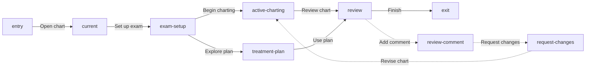

# Dental Chart journey lanes

This Markdown file is the source of truth for the Dental Chart app journey. OpenPencil
projects the referenced product views, Mermaid relationships, and feedback records into
native editable canvas objects.

```openpencil-journey
{
  "id": "dental-chart-journey-lanes",
  "label": "Dental Chart journey lanes",
  "pageId": "dental-chart",
  "route": "/dental-chart",
  "schemaVersion": "7",
  "sourceFile": "dental-chart-journey.md"
}
```

## Primary

```openpencil-view
{
  "id": "entry",
  "kind": "entry",
  "label": "Start",
  "lane": "primary"
}
```

```openpencil-view
{
  "id": "current",
  "kind": "screen",
  "label": "Current",
  "lane": "primary",
  "column": 0,
  "pageId": "dental-chart",
  "route": "/dental-chart",
  "state": "current"
}
```

```openpencil-view
{
  "id": "exam-setup",
  "kind": "screen",
  "label": "Exam setup",
  "lane": "primary",
  "column": 1,
  "pageId": "dental-chart",
  "route": "/dental-chart",
  "state": "exam-setup"
}
```

```openpencil-view
{
  "id": "active-charting",
  "kind": "screen",
  "label": "Active charting",
  "lane": "primary",
  "column": 2,
  "pageId": "dental-chart",
  "route": "/dental-chart",
  "state": "active-charting"
}
```

```openpencil-view
{
  "id": "review",
  "kind": "screen",
  "label": "Review",
  "lane": "primary",
  "column": 3,
  "pageId": "dental-chart",
  "route": "/dental-chart",
  "state": "review"
}
```

```openpencil-view
{
  "id": "exit",
  "kind": "exit",
  "label": "Done",
  "lane": "primary"
}
```

## Alternates

```openpencil-view
{
  "id": "treatment-plan",
  "kind": "screen",
  "label": "Treatment plan",
  "lane": "alternate",
  "column": 2,
  "pageId": "treatment-plan",
  "route": "/treatment-plan",
  "state": "treatment-plan"
}
```

## Feedback + rework

```openpencil-feedback
{
  "id": "review-comment",
  "kind": "feedback",
  "label": "Review comment",
  "lane": "feedback",
  "column": 3,
  "author": "Clinical review",
  "body": "Please confirm the distal contact and update mobility before completion."
}
```

```openpencil-feedback
{
  "id": "request-changes",
  "kind": "feedback",
  "label": "Request changes",
  "lane": "feedback",
  "column": 2,
  "author": "Chart review",
  "body": "Return to active charting, revise the finding, then resubmit for review."
}
```


