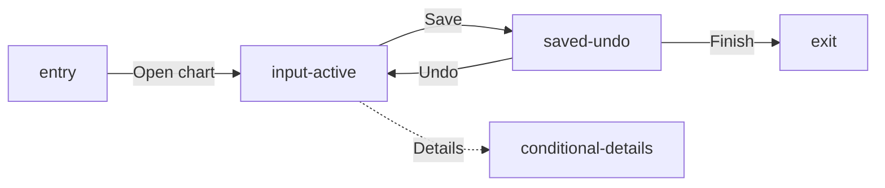

# Screen States — Dental Chart

This Markdown file is the source of truth for the compact Dental Chart screen
states board. It uses two native React-derived charting states and one concise
conditional card; it does not republish the legacy dental-chart journey states.

```openpencil-journey
{
  "id": "dental-chart-screen-states",
  "label": "Screen States — Dental Chart",
  "pageId": "dental-chart-screen-states",
  "route": "/dental-chart",
  "schemaVersion": "3",
  "sourceFile": "dental-chart-screen-states.md"
}
```

## Primary states

```openpencil-view
{
  "id": "entry",
  "kind": "entry",
  "label": "Start",
  "lane": "primary"
}
```

```openpencil-view
{
  "id": "input-active",
  "kind": "screen",
  "label": "Dental Chart input",
  "lane": "primary",
  "column": 0,
  "pageId": "dental-chart",
  "route": "/dental-chart",
  "state": "charting-controls"
}
```

```openpencil-view
{
  "id": "saved-undo",
  "kind": "screen",
  "label": "Dental Chart saved",
  "lane": "primary",
  "column": 1,
  "pageId": "dental-chart",
  "route": "/dental-chart",
  "state": "saved-undo"
}
```

```openpencil-view
{
  "id": "exit",
  "kind": "exit",
  "label": "Done",
  "lane": "primary"
}
```

## Evidence-supported conditional state

```openpencil-feedback
{
  "id": "conditional-details",
  "kind": "feedback",
  "label": "Conditional details",
  "lane": "feedback",
  "column": 1,
  "status": "DETAILS REQUIRED",
  "author": "Charting resolver",
  "body": "Resolve tooth or condition details first."
}
```


