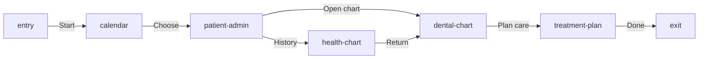

# Product Map — Dental Chart

This Markdown file is the source of truth for the Product Map — Dental Chart
overview. OpenPencil projects the five referenced product routes from trusted
self-contained React into native editable canvas layers. Stable source IDs make
re-imports idempotent while keeping intentional canvas overrides.

```openpencil-journey
{
  "id": "product-map-dental-chart",
  "label": "Product Map — Dental Chart",
  "pageId": "product-map-dental-chart",
  "route": "/dental-chart",
  "schemaVersion": "5",
  "sourceFile": "product-map.md"
}
```

## Primary

```openpencil-view
{
  "id": "entry",
  "kind": "entry",
  "label": "Start",
  "lane": "primary"
}
```

```openpencil-view
{
  "id": "calendar",
  "kind": "screen",
  "label": "Calendar",
  "lane": "primary",
  "column": 0,
  "pageId": "calendar",
  "route": "/calendar",
  "state": "calendar"
}
```

```openpencil-view
{
  "id": "patient-admin",
  "kind": "screen",
  "label": "Patient Admin",
  "lane": "primary",
  "column": 1,
  "pageId": "patient-admin",
  "route": "/patient-admin",
  "state": "patient-admin"
}
```

```openpencil-view
{
  "id": "dental-chart",
  "kind": "screen",
  "label": "Dental Chart",
  "lane": "primary",
  "column": 2,
  "pageId": "dental-chart",
  "route": "/dental-chart",
  "state": "dental-chart"
}
```

```openpencil-view
{
  "id": "treatment-plan",
  "kind": "screen",
  "label": "Treatment Plan",
  "lane": "primary",
  "column": 3,
  "pageId": "treatment-plan",
  "route": "/treatment-plan",
  "state": "treatment-plan"
}
```

```openpencil-view
{
  "id": "exit",
  "kind": "exit",
  "label": "Done",
  "lane": "primary"
}
```

## Supporting branch

```openpencil-view
{
  "id": "health-chart",
  "kind": "screen",
  "label": "Health Chart",
  "lane": "alternate",
  "column": 2,
  "pageId": "health-chart",
  "route": "/health-chart",
  "state": "health-chart"
}
```


