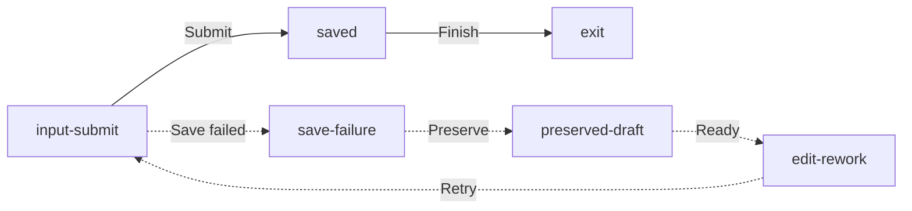

# Recovery Flow — Save Finding

This Markdown file is the source of truth for the Save Finding recovery board.
It reuses native editable Dental Chart input and saved/undo states, with native
recovery cards for the evidence-supported failure and rework paths.

```openpencil-journey
{
  "id": "save-finding-recovery",
  "label": "Recovery Flow — Save Finding",
  "pageId": "save-finding-recovery",
  "route": "/dental-chart",
  "schemaVersion": "3",
  "sourceFile": "save-finding-recovery.md"
}
```

## Primary path

```openpencil-view
{
  "id": "input-submit",
  "kind": "screen",
  "label": "Dental Chart input",
  "lane": "primary",
  "column": 0,
  "pageId": "dental-chart",
  "route": "/dental-chart",
  "state": "charting-controls"
}
```

```openpencil-view
{
  "id": "saved",
  "kind": "screen",
  "label": "Dental Chart saved",
  "lane": "primary",
  "column": 1,
  "pageId": "dental-chart",
  "route": "/dental-chart",
  "state": "saved-undo"
}
```

```openpencil-view
{
  "id": "exit",
  "kind": "exit",
  "label": "Done",
  "lane": "primary"
}
```

## Recovery and rework

```openpencil-feedback
{
  "id": "save-failure",
  "kind": "feedback",
  "label": "Save failed",
  "lane": "feedback",
  "column": 1,
  "status": "SAVE FAILED",
  "author": "Persistence",
  "body": "Write not confirmed; keep the draft and retry."
}
```

```openpencil-feedback
{
  "id": "preserved-draft",
  "kind": "feedback",
  "label": "Preserved draft",
  "lane": "feedback",
  "column": 0,
  "status": "DRAFT PRESERVED",
  "author": "Recovery",
  "body": "Keep the selected tooth and finding available."
}
```

```openpencil-feedback
{
  "id": "edit-rework",
  "kind": "feedback",
  "lane": "feedback",
  "column": 2,
  "label": "Retry save",
  "status": "READY TO RETRY",
  "author": "Recovery",
  "body": "Edit if needed, then submit again."
}
```


