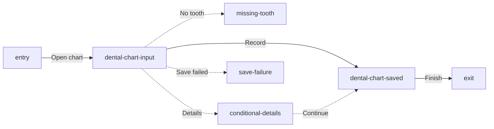

# Task Flow — Record Finding

This Markdown file is the source of truth for the focused Record Finding task.
It uses native editable Dental Chart input and saved states, with only the
evidence-supported missing-tooth, conditional, and save-failure branches.

```openpencil-journey
{
  "id": "task-flow-record-finding",
  "label": "Task Flow — Record Finding",
  "pageId": "task-flow-record-finding",
  "route": "/dental-chart",
  "schemaVersion": "3",
  "sourceFile": "task-flow-record-finding.md"
}
```

## Primary

```openpencil-view
{
  "id": "entry",
  "kind": "entry",
  "label": "Start",
  "lane": "primary"
}
```

```openpencil-view
{
  "id": "dental-chart-input",
  "kind": "screen",
  "label": "Dental Chart input",
  "lane": "primary",
  "column": 0,
  "pageId": "dental-chart",
  "route": "/dental-chart",
  "state": "charting-controls"
}
```

```openpencil-view
{
  "id": "dental-chart-saved",
  "kind": "screen",
  "label": "Dental Chart saved",
  "lane": "primary",
  "column": 1,
  "pageId": "dental-chart",
  "route": "/dental-chart",
  "state": "saved-undo"
}
```

```openpencil-view
{
  "id": "exit",
  "kind": "exit",
  "label": "Done",
  "lane": "primary"
}
```

## Evidence-supported exceptions

```openpencil-feedback
{
  "id": "missing-tooth",
  "kind": "feedback",
  "label": "Missing tooth",
  "lane": "feedback",
  "column": 0,
  "status": "VALIDATION",
  "author": "Validation",
  "body": "Select a tooth to continue."
}
```

```openpencil-feedback
{
  "id": "conditional-details",
  "kind": "feedback",
  "label": "Needs details",
  "lane": "feedback",
  "column": 1,
  "status": "REQUIRED",
  "author": "Charting resolver",
  "body": "Complete the required fields."
}
```

```openpencil-feedback
{
  "id": "save-failure",
  "kind": "feedback",
  "label": "Save failed",
  "lane": "feedback",
  "column": 2,
  "status": "RETRY",
  "author": "Persistence",
  "body": "The draft stays ready to retry."
}
```


