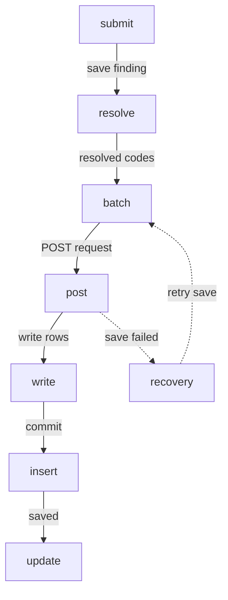

# Technical Flow — Save Finding

This board is the request/data path for saving a finding. It intentionally has
no Dental Chart web-view projection; the native Mermaid owner is the focal
artifact, with source retained in `technical-flow-save-finding.mmd`.

```openpencil-journey
{
  "id": "technical-flow-save-finding",
  "label": "Technical Flow — Save Finding",
  "pageId": "technical-flow-save-finding",
  "route": "/dental-chart",
  "schemaVersion": "4",
  "sourceFile": "technical-flow-save-finding.md"
}
```

## Technical path metadata

These blocks mirror the native boundary-aware technical diagram without
requesting live screen frames. The single recovery branch stays inside
Application services, beside the request phase it affects.

```openpencil-view
{
  "id": "submit",
  "kind": "screen",
  "label": "Submit finding · Dental Chart",
  "lane": "primary",
  "column": 0,
  "pageId": "dental-chart",
  "route": "/dental-chart",
  "state": "client-ui-submit"
}
```

```openpencil-view
{
  "id": "resolve",
  "kind": "screen",
  "label": "Resolve chart codes",
  "lane": "primary",
  "column": 0,
  "pageId": "dental-chart",
  "route": "/dental-chart",
  "state": "service-resolve-code"
}
```

```openpencil-view
{
  "id": "batch",
  "kind": "screen",
  "label": "Build payload",
  "lane": "primary",
  "column": 1,
  "pageId": "dental-chart",
  "route": "/dental-chart",
  "state": "service-build-payload"
}
```

```openpencil-view
{
  "id": "post",
  "kind": "screen",
  "label": "POST conditions · /api/patients/:id",
  "lane": "primary",
  "column": 2,
  "pageId": "dental-chart",
  "route": "/dental-chart",
  "state": "service-post-conditions"
}
```

```openpencil-view
{
  "id": "write",
  "kind": "screen",
  "label": "Write rows · Persistence adapter",
  "lane": "primary",
  "column": 2,
  "pageId": "dental-chart",
  "route": "/dental-chart",
  "state": "persistence-write-rows"
}
```

```openpencil-view
{
  "id": "insert",
  "kind": "screen",
  "label": "patient_conditions · Commit rows",
  "lane": "primary",
  "column": 3,
  "pageId": "dental-chart",
  "route": "/dental-chart",
  "state": "persistence-commit-rows"
}
```

```openpencil-view
{
  "id": "update",
  "kind": "screen",
  "label": "Saved · Patient store updated",
  "lane": "primary",
  "column": 2,
  "pageId": "dental-chart",
  "route": "/dental-chart",
  "state": "client-ui-save-confirmed"
}
```

```openpencil-view
{
  "id": "recovery",
  "kind": "screen",
  "label": "Save failed · Preserve & retry",
  "lane": "feedback",
  "column": 1,
  "pageId": "dental-chart",
  "route": "/dental-chart",
  "state": "service-save-recovery"
}
```


