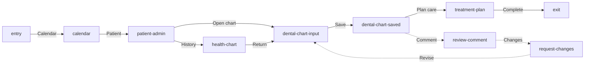

# User Journey — Complete Dental Exam

This Markdown file is the source of truth for the complete dental exam journey.
OpenPencil projects native editable Smylr views, the Health Chart safety branch,
Mermaid relationships, and concise review feedback into one ordinary board.
Each view retains React source, state bindings, and interaction metadata.

```openpencil-journey
{
  "id": "user-journey-complete-dental-exam",
  "label": "User Journey — Complete Dental Exam",
  "pageId": "user-journey-complete-dental-exam",
  "route": "/calendar",
  "schemaVersion": "3",
  "sourceFile": "user-journey-complete-dental-exam.md"
}
```

## Primary

```openpencil-view
{
  "id": "entry",
  "kind": "entry",
  "label": "Start",
  "lane": "primary"
}
```

```openpencil-view
{
  "id": "calendar",
  "kind": "screen",
  "label": "Calendar",
  "lane": "primary",
  "column": 0,
  "pageId": "calendar",
  "route": "/calendar",
  "state": "calendar"
}
```

```openpencil-view
{
  "id": "patient-admin",
  "kind": "screen",
  "label": "Patient Admin",
  "lane": "primary",
  "column": 1,
  "pageId": "patient-admin",
  "route": "/patient-admin",
  "state": "patient-admin"
}
```

```openpencil-view
{
  "id": "dental-chart-input",
  "kind": "screen",
  "label": "Dental Chart input",
  "lane": "primary",
  "column": 2,
  "pageId": "dental-chart",
  "route": "/dental-chart",
  "state": "charting-controls"
}
```

```openpencil-view
{
  "id": "dental-chart-saved",
  "kind": "screen",
  "label": "Dental Chart saved",
  "lane": "primary",
  "column": 3,
  "pageId": "dental-chart",
  "route": "/dental-chart",
  "state": "saved-undo"
}
```

```openpencil-view
{
  "id": "treatment-plan",
  "kind": "screen",
  "label": "Treatment Plan",
  "lane": "primary",
  "column": 4,
  "pageId": "treatment-plan",
  "route": "/treatment-plan",
  "state": "treatment-plan"
}
```

```openpencil-view
{
  "id": "exit",
  "kind": "exit",
  "label": "Done",
  "lane": "primary"
}
```

## Alternate safety branch

```openpencil-view
{
  "id": "health-chart",
  "kind": "screen",
  "label": "Health Chart",
  "lane": "alternate",
  "column": 2,
  "pageId": "health-chart",
  "route": "/health-chart",
  "state": "health-chart"
}
```

## Feedback + rework

```openpencil-feedback
{
  "id": "review-comment",
  "kind": "feedback",
  "label": "Review comment",
  "lane": "feedback",
  "column": 3,
  "author": "Clinical review",
  "body": "Confirm the finding before finish."
}
```

```openpencil-feedback
{
  "id": "request-changes",
  "kind": "feedback",
  "label": "Request changes",
  "lane": "feedback",
  "column": 2,
  "author": "Chart review",
  "body": "Return to chart, revise, and resubmit."
}
```


